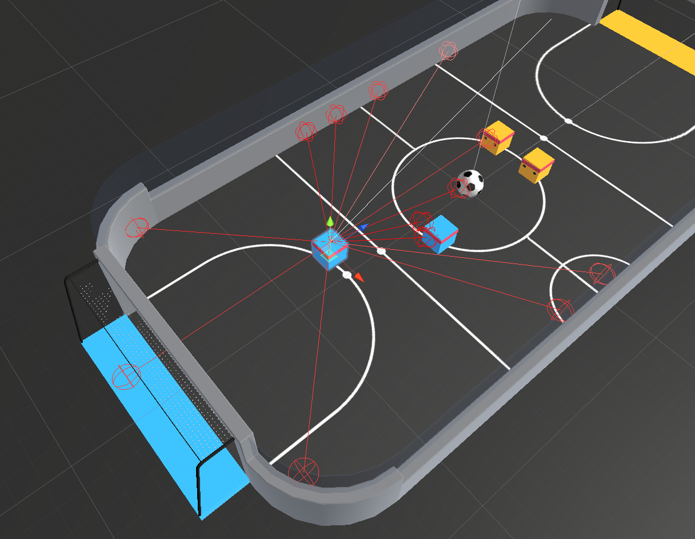

# Reinforcement Learning: Soccer Twos 
This repository contains implementations for training reinforcement learning agents in the [Soccer Twos environment](https://github.com/Unity-Technologies/ml-agents/blob/0.9.3/docs/Learning-Environment-Examples.md#soccer-twos) using Unity's Machine Learning Agents Toolkit. The environment consists of two goalkeeper agents and two striker agents, where the objective is to maximize the score by defending and attacking within the game.


## The Environment
* Set-up: Environment where four agents compete in a 2 vs 2 toy soccer game. Goalies are bounded to their goal area, and strikers are bounded to the remaining area of the field. 
* Goal:
  * Striker: Get the ball into the opponent's goal.
  * Goalie: Prevent the ball from entering its own goal.
* Agents: The environment contains four agents, with two linked to one Brain (strikers) and two linked to another (goalies).
* Agent Reward Function (dependent):
  * Striker:
    * +1 When ball enters opponent's goal.
    * -0.1 When ball enters own team's goal.
    * -0.001 Existential penalty.
  * Goalie:
    * -1 When ball enters team's goal.
    * +0.1 When ball enters opponents goal.
    * +0.001 Existential bonus.
* Behavior Parameters:
  * Vector Observation space: 112 corresponding to local 14 ray casts, each
    detecting 7 possible object types, along with the object's distance.
    Perception is in 180 degree view from front of agent.
  * Number of stacked Vector Observations: 3 frames
  * Vector Action space: (Discrete) One Branch
    * Striker: 
        - 0: forward
        - 1: backward
        - 2: rotate clockwise
        - 3: rotate counter-clockwise
        - 4: left
        - 5: right
    * Goalie: 
        - 0: forward
        - 1: backward
        - 2: left
        - 3: right
  * Visual Observations: None

  

## Dependencies
To set up your python environment to run the code in this repository, follow the instructions below.

1. Create (and activate) a new [conda environment](https://docs.anaconda.com/miniconda/miniconda-install/) with Python 3.6.

	- __Linux__ or __Mac__: 
	```bash
	conda create --name soccer2s python=3.6
	source activate soccer2s
	```
	- __Windows__: 
	```bash
	conda create --name soccer2s python=3.6 
	activate soccer2s
	```

2. If running in **Windows**, ensure you have the "Build Tools for Visual Studio 2022" installed from this [site](https://visualstudio.microsoft.com/downloads/). Ensure you select to download a Windows SDK and a MSVC version during installation. 

3. Perform a minimal install of OpenAI gym.  
    ```bash
    pip install gym
    conda install pystan
    conda install swig
    pip install Box2D
    pip install gym[all]
    pip install pyglet==1.2.4
    pip install gym[box2d]
    pip install gym[classic_control]
    ```
	- Some errors may appear with the box2d, but just ignore them.
    
4. Navigate to the `python/` folder. Then, install several dependencies.  
    ```bash
    cd python
    pip install .
    ```

5. Create an [IPython kernel](http://ipython.readthedocs.io/en/stable/install/kernel_install.html) for the `soccer2s` environment.
    ```bash
    python -m ipykernel install --user --name soccer2s --display-name "soccer2s"
    ```

6. Open a Jupyter Notebook from the command line. Before running code in a notebook, change the kernel to be `soccer2s`. 
    ```
    jupyter notebook
    ```
    - Kernel > Change kernel > `soccer2s`


<!-- Authors -->
## Authors
* [Justin Schubeck](https://www.linkedin.com/in/justinschubeck/)

Project Link: [https://github.com/justinschubeck/soccer-twos](https://github.com/justinschubeck/soccer-twos)

## Thank you